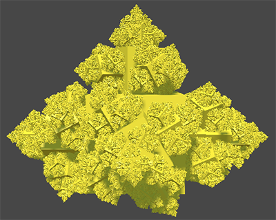

# [Catlike Coding Unity教程](https://catlikecoding.com/unity/tutorials/) 练习仓库
学习教程过程中跟着做的工程仓库，每一小章节都另外存了一份，方便从中间开始学。

## [Basics](https://catlikecoding.com/unity/tutorials/basics/)
[**Assets/1.Basic**](Assets/1.Basic)  
没有接触过ComputeShader和Job的话，可以看这篇熟悉一下。  
由于《Game Objects and Scripts》实在过于基础，所以从《Building a Graph》开始练习。  

  

## [Pseudorandom Noise](https://catlikecoding.com/unity/tutorials/pseudorandom-noise/)
[**Assets/2.Pseudorandom Noise**](Assets/2.Pseudorandom%20Noise)  
主要就是讲各种Noise，感觉普通项目里不太用得到，要自己做伪随机的话，可以参考参考。  
《Voronoi Noise》和《Simplex Noise》暂时还没有看，等把其他更想学的先练了再回过头来看这两章。  

  

## [Movement](https://catlikecoding.com/unity/tutorials/movement/)
[**Assets/6.Movement**](Assets/6.Movement)  
这篇是讲第三人称——小球的运动控制的，包括角色的基础运动、攀爬、与水交互。另外还有摄像机控制、特殊重力、可交互物体等。  
  
  
[**Assets/6.Movement/6.12.CustomPlus**](Assets/6.Movement/6.12.CustomPlus)  
这个文件夹是我在学完的基础上继续扩展了小球运动，脚本叫 [**MovingSpherePlus**](Assets/6.Movement/6.12.CustomPlus/MovingSpherePlus.cs) ，主要做了以下修改：  
* 跳跃高度  
  * 原设计：固定跳跃高度。  
  * 改为：分大小跳，跳跃上升期间提前放开跳跃键，跳跃高度会适当降低。  
* 蹬墙跳方向  
  * 原设计：跳跃方向固定。  
  * 改为：蹬墙跳时摇杆一定程度上影响跳跃方向。  
* 绕行  
  * 原设计：撞墙时让刚体自行计算侧滑速度。  
  * 改为：设置一定绕行角度，超过改角度才允许绕行。  
* 掉落  
  * 原设计：无最大掉落速度。  
  * 改为：设置最大掉落速度和最大擦墙掉落速度。  
* 攀爬面选择  
  * 原设计：同一帧接触多个可攀爬面时，最后一个可攀爬面作为实际攀爬面。  
  * 改为：同一帧接触多个可攀爬面时，视角最前方的可攀爬面作为实际攀爬面。  
* 接触水的状态  
  * 原设计：水没过一定高度才算游泳，否则为其他状态。  
  * 改为：按水浸高度区分潜水、漂浮和其他状态。  
* 水对跳跃的影响  
  * 原设计：跳跃时如果接触到水，跳跃会根据水浸高度受到一定的影响。  
  * 改为：跳跃时如果接触到水，跳跃根据水浸高度受到的影响程度可调。  
* 水中状态  
  * 原设计：在水中不算触地。  
  * 改为：在水中接触地面算触地。  
* 水中运动  
  * 原设计：游泳中支持垂直游动，不允许跳跃，不允许攀爬。  
  * 改为：设置自由潜水模式开关和潜水攀爬开关。  
    * 自由潜水开启时，潜水中支持上下游动，不允许跳跃，钻出水面后保持漂浮状态，支持跳跃或下潜。  
    * 自由潜水关闭时，潜水中自动下沉，允许小段跳跃（可视为向上游动），钻出水面后需要移动来保持漂浮状态，支持跳跃，静止会自动下沉。  
* 移动Snap影响水中跳跃问题  
  * 原设计：如果probeDistance设置稍大，在浅水处处于游泳状态时，跳起离开水面瞬间会被snap回地面，不过因为游泳状态不允许跳跃，所以绕过了这个问题。  
  * 改为：因为漂浮状态需要支持跳跃，所以不得不修复这个问题。  
